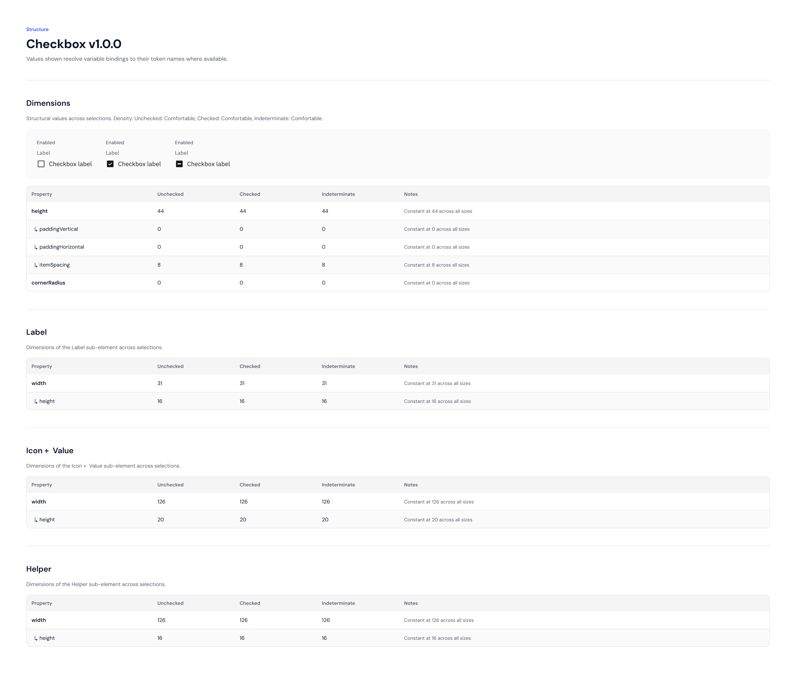
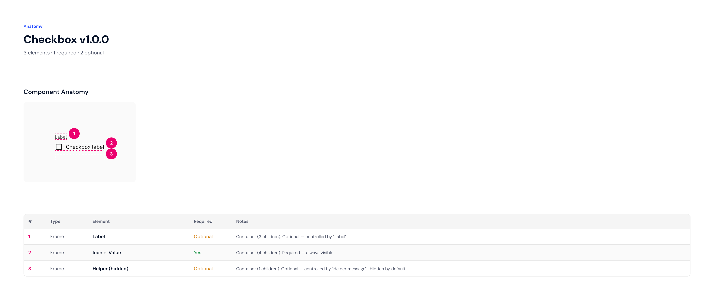
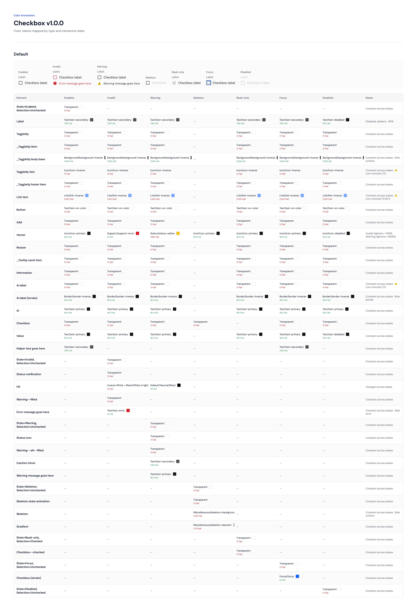

import { Callout } from '@/components/callout'

# Checkbox

A checkbox allows a user to select or deselect one or more items from a list. Checkboxes support three selection states — unchecked, checked, and indeterminate — and seven interactive states including enabled, invalid, warning, skeleton, read-only, focus, and disabled. You can change a checkbox item's selection, state, and style using the variants switcher.

---

## What's New in v1.0.0

**Changed**

- Updated component to stable v1.0.0 release
- Color of the checkbox icon was updated (v0.1.0)
- Additional variant refinements applied (v0.1.1, v0.1.2)

**Version history (from Figma changelog):**

| Date | Version | Type | Author | Notes |
|------|---------|------|--------|-------|
| 2026-04-22 | v1.0.0 | changed | carolina kim candido da silva | I updated |
| 2026-04-22 | v0.1.2 | changed | carolina kim candido da silva | I changed something else |
| 2026-04-22 | v0.1.1 | changed | carolina kim candido da silva | I changed this just now |
| 2026-04-22 | v0.1.0 | changed | carolina kim candido da silva | The color of the checkbox was changed |

---

## Preview

### Structure



### Anatomy



The Checkbox has 3 anatomical elements — 1 required and 2 optional:

| # | Type | Element | Required | Notes |
|---|------|---------|---------|-------|
| 1 | Frame | Label | Optional | Container (3 children). Controlled by the `Label` property. |
| 2 | Frame | Icon + Value | **Yes** | Container (4 children). Always visible. |
| 3 | Frame | Helper (hidden) | Optional | Container (1 child). Controlled by `Helper message`. Hidden by default. |

### Color tokens



### Screen reader states


---

## Props

| Prop | Type | Values | Default | Required | Description |
|------|------|--------|---------|----------|-------------|
| `State` | `variant` | Enabled, Invalid, Warning, Skeleton, Read-only, Focus, Disabled | `Enabled` | No | Visual and interactive state of the checkbox. |
| `Selection` | `variant` | Unchecked, Checked, Indeterminate | `Unchecked` | No | Selection state of the checkbox icon. |
| `Indented` | `boolean` | true, false | `false` | No | Adds a spacer before the checkbox for nested list hierarchy. |
| `Label` | `boolean` | true, false | `true` | No | Shows or hides the top label element. |
| `Value` | `boolean` | true, false | `true` | No | Shows or hides the inline checkbox label text. |
| `Error message` | `boolean` | true, false | `true` | No | Shows or hides the error message (visible when State is Invalid). |
| `Warning message` | `boolean` | true, false | `true` | No | Shows or hides the warning message (visible when State is Warning). |
| `Helper message` | `boolean` | true, false | `false` | No | Shows or hides helper text below the checkbox row. |
| `Show toggletip` | `boolean` | true, false | `false` | No | Shows an information icon with toggletip next to the label. |
| `Value text` | `text` | String | `Checkbox label` | No | Text label displayed next to the checkbox icon. |
| `Label text` | `text` | String | `Label` | No | Text for the top label element. |
| `Error text` | `text` | String | `Error message goes here` | No | Error message shown when State is Invalid. |
| `Warning text` | `text` | String | `Warning message goes here` | No | Warning message shown when State is Warning. |
| `Helper text` | `text` | String | `Helper text goes here` | No | Helper text shown below the checkbox when Helper message is enabled. |

---

## Variants

The `Checkbox` supports the following states:

- **Enabled** — default interactive state
- **Invalid** — validation error; shows error message
- **Warning** — caution state; shows warning message
- **Skeleton** — loading placeholder state
- **Read-only** — non-interactive, value visible
- **Focus** — keyboard focus ring visible
- **Disabled** — non-interactive, visually muted

And three selection states: **Unchecked**, **Checked**, **Indeterminate**.

---

## States

| State | Behavior |
|-------|----------|
| `Enabled` | Default. Fully interactive. |
| `Invalid` | Shows error styling and an error message below the checkbox. |
| `Warning` | Shows warning styling and a warning message below the checkbox. |
| `Skeleton` | Renders a loading skeleton placeholder; non-interactive. |
| `Read-only` | Displays the current value without allowing changes. |
| `Focus` | Shows a visible focus ring; used for keyboard navigation. |
| `Disabled` | Fully non-interactive; visually muted to indicate unavailability. |

---

## Dimensions

All values are constant across Unchecked, Checked, and Indeterminate selections:

| Property | Value | Notes |
|----------|-------|-------|
| `height` | 44px | Constant at 44 across all sizes |
| `paddingVertical` | 0px | Constant |
| `paddingHorizontal` | 0px | Constant |
| `itemSpacing` | 8px | Gap between icon and label text |
| `cornerRadius` | 0px | No rounding |

---

## Design Tokens

These design tokens are consumed by this component. Modifying them will affect all instances.

| Token | Value |
|-------|-------|
| `text/text-primary` | `#161616` |
| `text/text-secondary` | `#525252` |
| `link/link-inverse` | link-inverse ramp |
| `icon/icon-primary` | icon-primary ramp |
| `icon/icon-on-color` | icon-on-color ramp |
| `support/support-error` | error red |
| `support/support-warning--alt-filled` | warning amber |
| `background/background-inverse` | inverse background |
| `focus/focus` | `#0F62FE` |
| `field/field-disabled` | disabled field tint |

---

## Accessibility

**ARIA Role:** `checkbox`
**WCAG Level:** `AA`

**Keyboard Interaction:**
Space to toggle checked/unchecked; Tab to navigate between checkboxes.

**Required ARIA Attributes:**
- `aria-label`
- `aria-checked`
- `aria-disabled`

**Screen reader states:**

| Selection | ARIA |
|-----------|------|
| Unchecked | `role=checkbox`, `aria-checked=false` |
| Checked | `role=checkbox`, `aria-checked=true` |
| Indeterminate | `role=checkbox`, `aria-checked=mixed` |
| Disabled | `role=checkbox`, `aria-disabled=true` |
| Read-only | `role=checkbox`, `aria-readonly=true` |

The indeterminate state must be set programmatically via `aria-checked="mixed"` — it cannot be conveyed through visual styling alone.

---

## Usage Guidelines

### Do

- Use checkboxes to allow users to select one or more options from a visible list
- Use the indented variant to create visual hierarchy in nested checkbox lists
- Display a helper message to provide additional context about the option
- Use the label property for grouped checkbox sets to describe the group

### Don't

- Do not use a checkbox when only one option can be selected — use a Radio button instead
- Do not use a checkbox for a binary on/off action that takes immediate effect — use a Toggle instead
- Do not use checkboxes as action buttons or navigation triggers

---

## Dependencies

This component has no internal dependencies.

See also: [Carbon Design System — Checkbox](https://www.carbondesignsystem.com/components/checkbox/usage/)

---

## Technical Snapshot

> This block is machine-readable and used for automated change detection. Do not edit manually.

```json
{
  "props": [
    { "name": "State", "type": "variant", "values": ["Enabled","Invalid","Warning","Skeleton","Read-only","Focus","Disabled"], "default": "Enabled", "required": false, "description": "Visual and interactive state of the checkbox." },
    { "name": "Selection", "type": "variant", "values": ["Unchecked","Checked","Indeterminate"], "default": "Unchecked", "required": false, "description": "Selection state of the checkbox icon." },
    { "name": "Indented", "type": "boolean", "values": ["true","false"], "default": "false", "required": false, "description": "Adds a spacer before the checkbox for nested list hierarchy." },
    { "name": "Label", "type": "boolean", "values": ["true","false"], "default": "true", "required": false, "description": "Shows or hides the top label element." },
    { "name": "Value", "type": "boolean", "values": ["true","false"], "default": "true", "required": false, "description": "Shows or hides the inline checkbox label text." },
    { "name": "Error message", "type": "boolean", "values": ["true","false"], "default": "true", "required": false, "description": "Shows or hides the error message." },
    { "name": "Warning message", "type": "boolean", "values": ["true","false"], "default": "true", "required": false, "description": "Shows or hides the warning message." },
    { "name": "Helper message", "type": "boolean", "values": ["true","false"], "default": "false", "required": false, "description": "Shows or hides helper text below the checkbox row." },
    { "name": "Show toggletip", "type": "boolean", "values": ["true","false"], "default": "false", "required": false, "description": "Shows an information icon with toggletip next to the label." },
    { "name": "Value text", "type": "text", "values": ["String"], "default": "Checkbox label", "required": false, "description": "Text label displayed next to the checkbox icon." },
    { "name": "Label text", "type": "text", "values": ["String"], "default": "Label", "required": false, "description": "Text for the top label element." },
    { "name": "Error text", "type": "text", "values": ["String"], "default": "Error message goes here", "required": false, "description": "Error message shown when State is Invalid." },
    { "name": "Warning text", "type": "text", "values": ["String"], "default": "Warning message goes here", "required": false, "description": "Warning message shown when State is Warning." },
    { "name": "Helper text", "type": "text", "values": ["String"], "default": "Helper text goes here", "required": false, "description": "Helper text shown below the checkbox when Helper message is enabled." }
  ],
  "variants": ["Enabled","Invalid","Warning","Skeleton","Read-only","Focus","Disabled"],
  "selections": ["Unchecked","Checked","Indeterminate"],
  "variantCount": 19,
  "states": ["Enabled","Invalid","Warning","Skeleton","Read-only","Focus","Disabled"],
  "accessibility": {
    "role": "checkbox",
    "keyboard": "Space to toggle; Tab to navigate",
    "aria_labels": ["aria-label","aria-checked","aria-disabled"],
    "wcag_level": "AA"
  }
}
```
